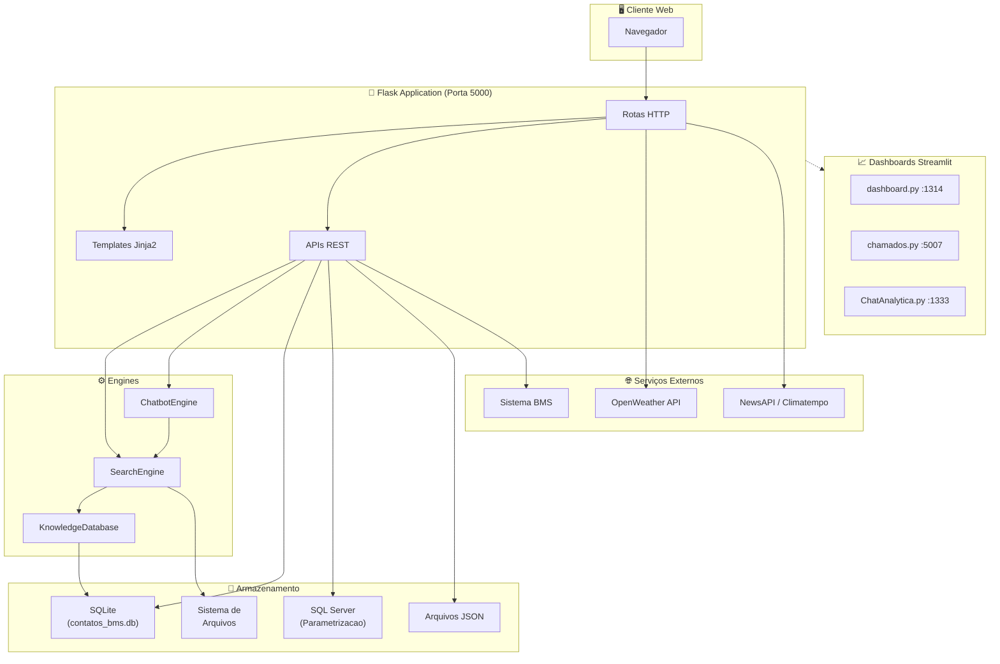
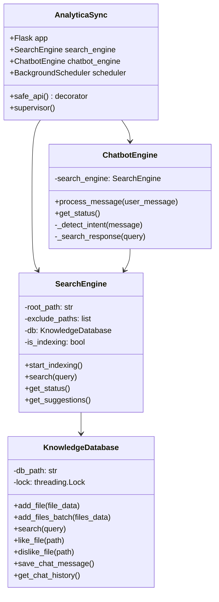
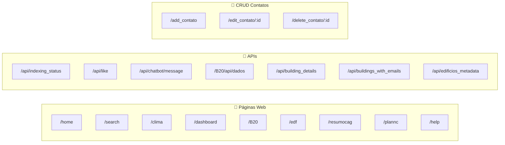
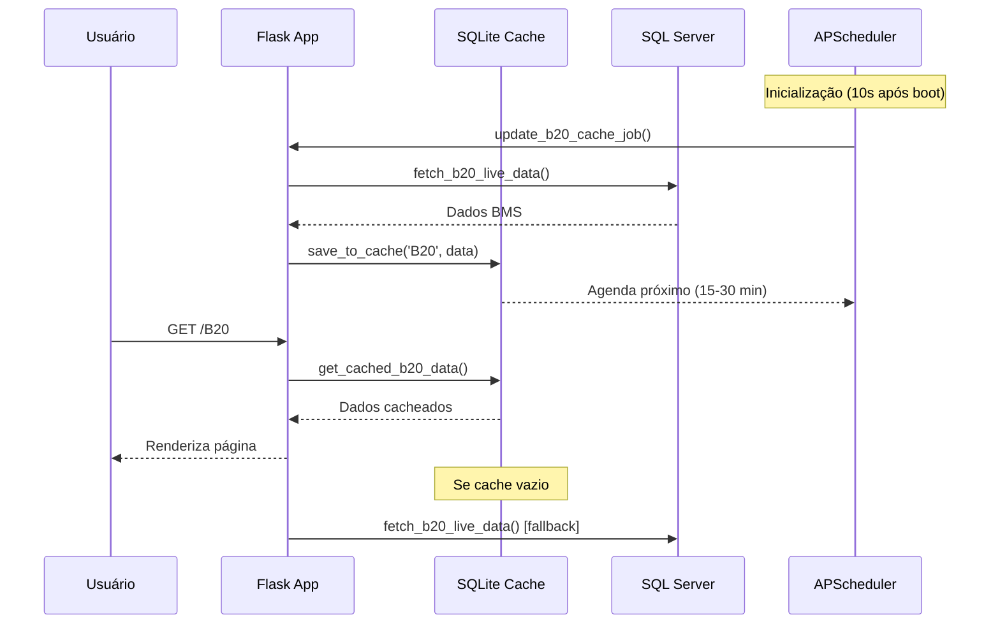
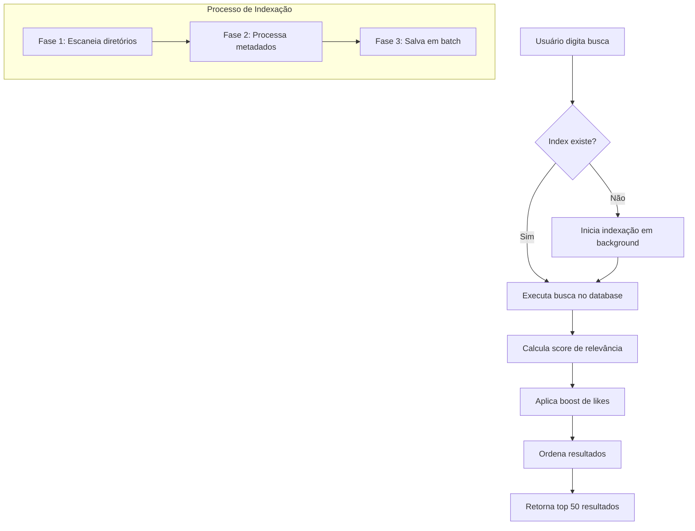
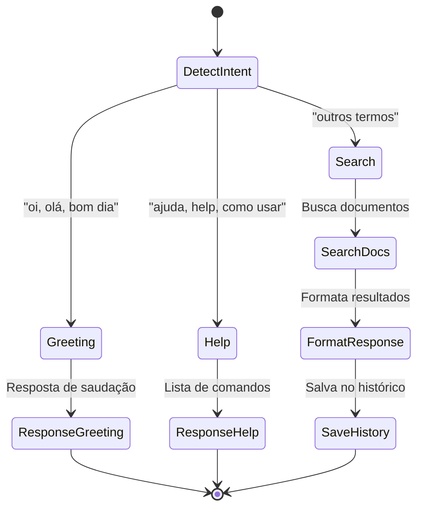
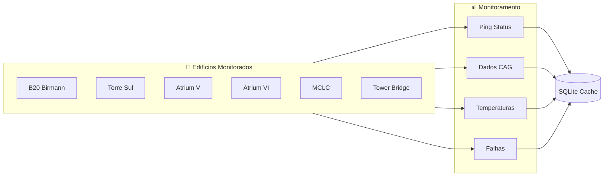
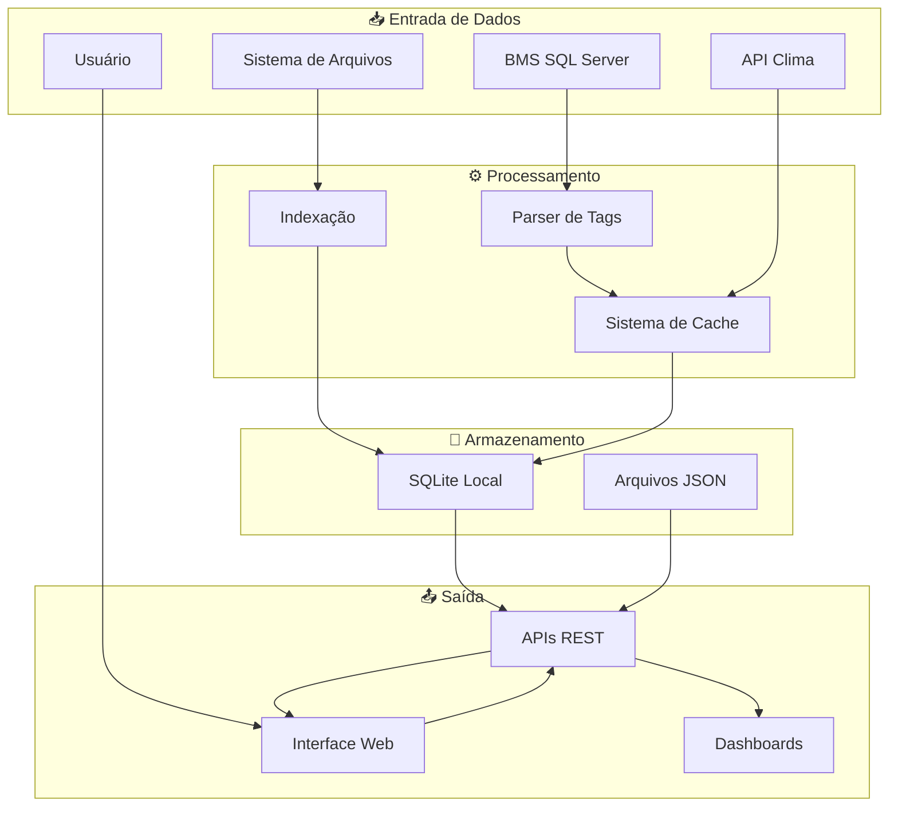
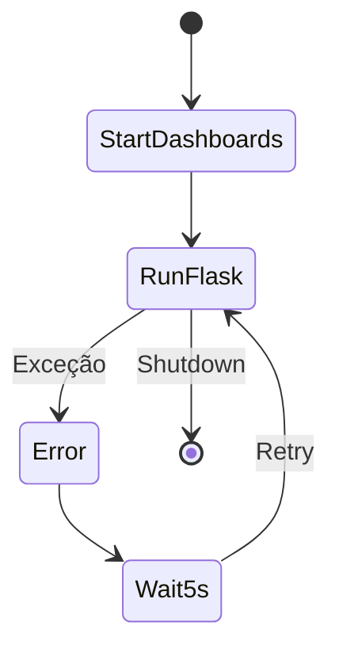

# EVT AnalyticaSync - Documentação Completa do Sistema

> **Versão:** 1.0  
> **Data:** 25/01/2026  
> **Sistema:** Plataforma de Monitoramento e Gestão de Edifícios

---

## 📋 Índice

1. [Visão Geral](#visão-geral)
2. [Arquitetura do Sistema](#arquitetura-do-sistema)
3. [Módulos Principais](#módulos-principais)
4. [Rotas e APIs](#rotas-e-apis)
5. [Sistema de Cache](#sistema-de-cache)
6. [Search Engine](#search-engine)
7. [Chatbot](#chatbot)
8. [Monitoramento de Edifícios](#monitoramento-de-edifícios)
9. [Configuração e Variáveis de Ambiente](#configuração-e-variáveis-de-ambiente)
10. [Fluxo de Dados](#fluxo-de-dados)

---

## Visão Geral

O **EVT AnalyticaSync** é uma plataforma web desenvolvida em Flask para monitoramento em tempo real de sistemas de HVAC (Heating, Ventilation, and Air Conditioning), gestão de contatos, busca de documentos e integração com sistemas BMS (Building Management System).

### Principais Funcionalidades

- 🏢 **Monitoramento de Edifícios** - Status em tempo real de equipamentos CAG (Central de Água Gelada)
- 🔍 **Sistema de Busca** - Indexação e busca inteligente de documentos
- 🤖 **Chatbot Integrado** - Assistente para consulta de documentação
- 📊 **Dashboard B20** - Visualização de dados de temperatura e falhas
- 👥 **Gestão de Contatos** - Plano de chamados com CRUD completo
- 🌤️ **Integração Clima** - Dados meteorológicos e notícias

---

## Arquitetura do Sistema

### Diagrama Geral da Arquitetura



### Stack Tecnológico

| Componente | Tecnologia |
|------------|------------|
| Backend | Python 3.11 + Flask |
| Frontend | HTML5 + Jinja2 + CSS + JavaScript |
| Banco Local | SQLite |
| Banco Externo | SQL Server (via pyodbc) |
| Scheduler | APScheduler |
| Dashboards | Streamlit |
| Cache | SQLite (tabela building_cache) |

---

## Módulos Principais

### Diagrama de Módulos



### 1. AnalyticaSync.py (Principal)

Arquivo principal da aplicação Flask contendo:
- Configuração do servidor
- Todas as rotas HTTP
- APIs REST
- Sistema de cache para dados B20
- Gerenciador de dashboards Streamlit
- Integração com clima e notícias

### 2. search_engine.py

Motor de busca de documentos:
- Indexação assíncrona em background
- Suporte a Windows long paths
- Busca por relevância com scoring
- Sistema de likes para ranking

### 3. chatbot.py

Engine do chatbot:
- Detecção de intenção (greeting, help, search)
- Busca em documentos indexados
- Formatação de respostas
- Histórico de conversas

### 4. knowledge_database.py

Banco de dados de conhecimento:
- Armazenamento thread-safe
- WAL mode para concorrência
- Cache de metadados de arquivos
- Sistema de ratings (likes/dislikes)

---

## Rotas e APIs

### Diagrama de Rotas



### Tabela Completa de Rotas

| Rota | Método | Descrição |
|------|--------|-----------|
| `/` | GET | Redireciona para /home |
| `/home` | GET | Página inicial |
| `/search` | GET | Sistema de busca de documentos |
| `/B20` | GET | Dashboard do edifício B20 |
| `/resumocag` | GET | Resumo da Central de Água Gelada |
| `/edf` | GET | Painel de edifícios |
| `/clima` | GET | Informações meteorológicas |
| `/dashboard` | GET | Dashboard geral |
| `/plannc` | GET | Plano de chamados (contatos) |
| `/help` | GET | Página de ajuda |
| `/TSUL` | GET | Template Torre Sul |
| `/vcz2` | GET | Template Vera Cruz II |

### APIs REST

| Endpoint | Método | Descrição |
|----------|--------|-----------|
| `/api/indexing_status` | GET | Status da indexação |
| `/api/like` | POST | Incrementa like de arquivo |
| `/api/dislike` | POST | Incrementa dislike de arquivo |
| `/api/likes/<path>` | GET | Retorna likes de arquivo |
| `/api/top_rated` | GET | Arquivos mais bem avaliados |
| `/api/chatbot/message` | POST | Envia mensagem ao chatbot |
| `/api/chatbot/history` | GET | Histórico do chatbot |
| `/api/chatbot/clear` | POST | Limpa histórico do chatbot |
| `/api/chatbot/status` | GET | Status do chatbot |
| `/B20/api/dados` | GET | Dados B20 em JSON |
| `/B20/api/detalhes/<andar>/<equip>` | GET | Detalhes de equipamento |
| `/api/building_details/<name>` | GET | Detalhes de edifício |
| `/api/buildings_with_emails` | GET | Edifícios com emails |
| `/api/save_emails` | POST | Salva emails de edifício |
| `/api/edificios_metadata` | GET | Metadados de edifícios |
| `/api/edificio_metadata/<nome>` | GET | Metadados de edifício específico |
| `/api/edificio_metadata` | POST | Atualiza metadados |

---

## Sistema de Cache

### Diagrama do Fluxo de Cache



### Estrutura da Tabela de Cache

```sql
CREATE TABLE building_cache (
    building_name TEXT PRIMARY KEY,
    data_json TEXT,
    last_updated TEXT,
    next_update TEXT
);
```

### Jobs Agendados

| Job | Intervalo | Descrição |
|-----|-----------|-----------|
| `update_b20_cache_job` | 15-30 min (random) | Atualiza cache B20 e Summary |
| `update_weather_history` | 15 min | Coleta dados meteorológicos |

---

## Search Engine

### Diagrama do Fluxo de Busca



### Algoritmo de Scoring

```
score = (relevância_título × 10) + (relevância_conteúdo × 2) + (likes × 5)
```

### Tipos de Arquivo Suportados

| Categoria | Extensões |
|-----------|-----------|
| Documentos | .pdf, .doc, .docx, .xlsx, .pptx, .txt |
| Imagens | .jpg, .jpeg, .png, .gif, .svg |
| Vídeos | .mp4, .avi, .mov |
| Áudio | .mp3, .wav |
| Código | .py, .js, .html, .css |

---

## Chatbot

### Diagrama de Intenções



### Estrutura de Resposta

```json
{
  "success": true,
  "message": "Texto da resposta",
  "type": "search|greeting|help|error",
  "documents": [
    {
      "title": "Nome do arquivo",
      "path": "/caminho/arquivo.pdf",
      "snippet": "Trecho relevante...",
      "score": 85.5
    }
  ],
  "timestamp": "2026-01-25T19:23:00"
}
```

---

## Monitoramento de Edifícios

### Diagrama de Status de Edifícios



### Mapa de IPs dos Edifícios

O sistema monitora mais de 30 edifícios com pings periódicos para verificar conectividade:

| Edifício | IP Principal |
|----------|-------------|
| B20 | 192.168.168.4 |
| Torre Sul | 192.168.239.249 |
| Atrium V | 192.168.16.114 |
| Atrium VI | 192.168.30.98 |
| Tower Bridge | 192.168.159.250 |
| Américas Corporate | 172.17.10.240 |

---

## Configuração e Variáveis de Ambiente

### Arquivo .env

```env
# Banco de Dados SQL Server
DB_DRIVER=ODBC Driver 17 for SQL Server
DB_SERVER=<seu_servidor_aqui>
DB_NAME=<nome_do_banco>
DB_USER=<seu_usuario>
DB_PASSWORD=<sua_senha_segura>

# APIs Externas
OPENWEATHER_API_KEY=<sua_api_key_openweather>
NEWS_API_KEY=<sua_api_key_news>
CITY=São Paulo,BR

# SQLite
DB_PATH=<caminho_para_db_local>.db
```

### Portas Utilizadas

| Porta | Serviço |
|-------|---------|
| 5000 | Flask Principal |
| 1314 | Dashboard Streamlit |
| 1333 | ChatAnalytica |
| 5007 | Chamados |
| 5008 | Dashboard Secundário |

---

## Fluxo de Dados

### Diagrama de Fluxo Completo



### Ciclo de Atualização

```mermaid
gantt
    title Ciclo de Atualização de Dados
    dateFormat HH:mm
    section Cache B20
    Coleta SQL    :a1, 00:00, 10s
    Salva Cache   :a2, after a1, 5s
    Agenda Job    :a3, after a2, 5s
    
    section Weather
    API Call      :b1, 00:00, 3s
    Salva DB      :b2, after b1, 2s
    
    section Indexação
    Scan Dirs     :c1, 00:00, 30s
    Process Files :c2, after c1, 60s
    Save Batch    :c3, after c2, 10s
```



---

## Tratamento de Erros

### Decorator safe_api

O sistema utiliza um decorator universal para captura de exceções:

```python
@safe_api
def minha_rota():
    # Erros são capturados automaticamente
    # e retornados como JSON com status apropriado
```

### Códigos de Erro

| Código | Significado |
|--------|-------------|
| 200 | Sucesso |
| 400 | Requisição inválida |
| 403 | Permissão negada |
| 404 | Não encontrado |
| 500 | Erro interno |

---

## Supervisor e Auto-Restart

O sistema possui um supervisor que reinicia automaticamente em caso de falha:



---

## Estrutura de Diretórios

```
Analytica/
├── AnalyticaSync.py      # Aplicação principal
├── search_engine.py      # Motor de busca
├── chatbot.py            # Engine do chatbot
├── knowledge_database.py # Database de conhecimento
├── dashboard.py          # Dashboard Streamlit
├── chamados.py           # Sistema de chamados
├── ChatAnalytica.py      # Interface chat Streamlit
├── .env                  # Variáveis de ambiente
├── contatos_bms.db       # SQLite principal
├── templates/            # Templates HTML
│   ├── index.html
│   ├── search.html
│   ├── B20.html
│   ├── cag.html
│   ├── edf.html
│   └── ...
├── static/               # Arquivos estáticos
│   ├── css/
│   └── js/
├── search_cache/         # Cache de busca
│   └── knowledge.db
├── data/                 # Dados JSON
├── BI/                   # Emails BI
├── AC/                   # Emails AC
└── logs/                 # Logs do sistema
```

---

## Conclusão

O **EVT AnalyticaSync** é uma plataforma robusta e modular para gestão de edifícios, oferecendo:

- ✅ Alta disponibilidade com auto-restart
- ✅ Cache inteligente para performance
- ✅ Busca indexada de documentos
- ✅ Chatbot integrado
- ✅ Monitoramento em tempo real
- ✅ APIs REST para integração
- ✅ Interface web responsiva

Para suporte ou dúvidas, consulte a equipe de desenvolvimento.

---

*Documentação gerada automaticamente em 25/01/2026*
