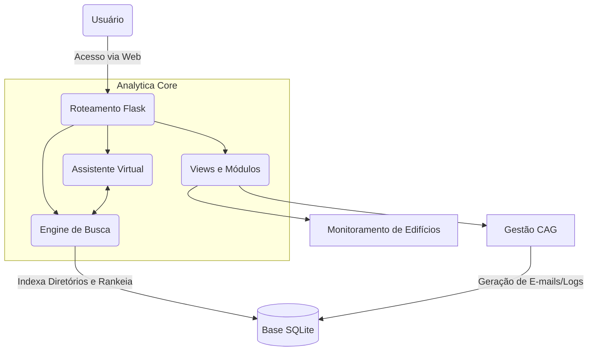

<div align="center">
  
  <h1>Analytica: Interlinked Ecosystem</h1>
  <p><strong>Plataforma Profissional de Monitoramento e Gestão de Infraestruturas Corporativas</strong></p>
  
  <p>
    <a href="#-visão-geral">Visão Geral</a> •
    <a href="#-principais-módulos">Funcionalidades</a> •
    <a href="#-tecnologias">Tecnologias</a> •
    <a href="#-instalação-e-uso">Instalação</a> •
    <a href="#-arquitetura">Arquitetura</a>
  </p>
</div>

---

## 🔍 Visão Geral

O **Analytica** é um sistema projetado para revolucionar a forma como grandes centros corporativos gerenciam suas infraestruturas de missão crítica (BMS, CAG, Sensores IoT). 

Construído com uma interface premium ("dark glassmorphism"), ele centraliza dados operacionais e os traduz em inteligência, oferecendo automação, monitoramento em tempo real e um ecossistema focado na tomada rápida de ação.

---

## 🚀 Principais Módulos

- 🏢 **Monitoramento de Edifícios (`/edf`)**: Visualização consolidada de todo o portfólio. Acompanhe a disponibilidade de redes (ping), telemetria climática local e saúde das conexões de infraestrutura.
- ❄️ **CAG - Central de Água Gelada (`/cag`)**: Automação profunda para Chillers e Torres de Resfriamento. Conta com logs imutáveis e disparos sistêmicos de e-mails para formalização técnica (Partida/Desligamento).
- 🔍 **Search & Inteligência (`/search`)**: Motor avançado de indexação de documentos que funciona com sistema de _Likes_ (rankeamento). Totalmente integrado a um assistente virtual IA **100% autônomo** (sem dependência de APIs externas).
- 📊 **Dashboards (`/dashboard`)**: Painéis executivos com volumetria de chamados, controle do edifício B20 e análise sintética de anomalias (HVAC).
- 📋 **Plano de Chamados (`/plannc`)**: Repositório de contatos estratégicos filtrado de forma inteligente por prédio e nível de atuação.

---

## 💻 Tecnologias

O ecossistema é suportado por uma _stack_ de alta performance, projetada para instâncias robustas:

- **Back-End**: Python 3.10+, Flask, SQLite3 (Thread-safe, WAL Mode).
- **Front-End**: HTML5 Semântico, CSS3 (Glassmorphism UI), Vanilla JavaScript.
- **Background Jobs**: APScheduler (sincronismo de dados BMS em tempo real).
- **IA e Processamento**: TFI Classifier, OCR Simples, NLP básico (regras locais de heurística do Chatbot).

---

## ⚙️ Instalação e Uso

### Requisitos Pré-vios
- **Python 3.10** ou superior.
- Git.
- (Opcional) Ambiente Linux (como Arch Linux, Ubuntu) para a utilização direta via bash.

### Via Bash Script (Arch Linux / Linux Universal)

Na raiz do projeto há um script preparado para criar a infraestrutura autônoma (virtualenv) de maneira isolada:

```bash
# 1. Clone o repositório
git clone git@github.com:luccajuccy/Analytica.git
cd Analytica

# 2. Dê permissão e execute o start script
chmod +x start.sh
./start.sh
```

O próprio script instalará as dependências (`requirements.txt`) e iniciará o servidor Flask localmente na porta `5000`. Acesse `http://localhost:5000` em seu navegador.

---

## 🏗️ Arquitetura (Visão Sintética)



> **Nota para a equipe**: A documentação interna expandida (incluindo prints, funis B2B de assinaturas e anúncios para SaaS) encontra-se no diretório `/documentation/README.md`.

---

<div align="center">
  <b>Analytica © 2026</b><br>
  <i>Desenvolvido para ecossistemas de alta performance técnica.</i>
</div>
