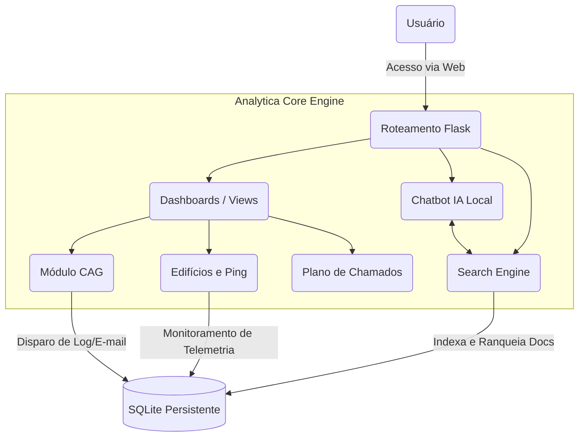

<div align="center">
  
  <h1>Analytica: Interlinked Ecosystem</h1>
  <p>Plataforma Profissional de Monitoramento e Gestão de Infraestruturas Corporativas</p>
</div>

<p align="center">
  <a href="#visao-geral">Visão Geral</a> •
  <a href="#funcionalidades">Funcionalidades</a> •
  <a href="#arquitetura-e-fluxo">Arquitetura e Fluxo</a> •
  <a href="#telas-do-sistema">Telas do Sistema</a> •
  <a href="#monetizacao">Assinaturas e Anúncios</a> •
  <a href="#instalação">Instalação</a>
</p>

---

## 🔍 Visão Geral

O **Analytica** é um sistema projetado para revolucionar a forma como grandes centros corporativos gerenciam suas infraestruturas (BMS, CAG, Sensores IoT). Construído com uma interface premium ("dark glassmorphism"), ele centraliza dados operacionais e os traduz em inteligência e tomada de ação.

---

## 🚀 Funcionalidades

- **Monitoramento de Edifícios (`/edf`)**: Visualização do status de disponibilidade de redes corporativas, ping em tempo real, monitoramento climático local, sensores e health checks.
- **CAG - Central de Água Gelada (`/cag`)**: Controle e automação dos chillers, com logs imutáveis e disparos automáticos de e-mail de formalização (Partida/Desligamento).
- **Busca e Chatbot (`/search`)**: Motor de indexação com ranqueamento (Sistema de Likes) integrado com um assistente virtual IA sem necessidade de dependência externa de APIs.
- **Dashboards (`/dashboard`)**: Visões executivas, painéis táticos em tempo real, gestão de chamados (B20, Torre Sul, etc).
- **Plano de Chamados (`/plannc`)**: Repositório seguro e otimizado para gestão de contatos estratégicos por prédio e atuação (Gestão Ágil).

---

## 🏗️ Arquitetura e Fluxo (Mermaid)

O fluxo da aplicação interliga o cliente às _engines_ de dados internas e componentes visuais.



---

## 📱 Telas do Sistema

### 1. Dashboard Desktop
> ![Insira o print aqui]
*Painel de controle principal com métricas operacionais em tempo real.*

### 2. Monitoramento de Edifícios
> ![Insira o print aqui]
*Visão detalhada do portfólio de edifícios, contendo sparklines, mapa geoespacial e indicadores de saúde (ping/uptime).*

### 3. Assistente Analytica (Mobile & Desktop)
> ![Insira o print aqui]
*Chatbot com inteligência local, interface elegante e ações rápidas sobre a base de dados corporativa.*

### 4. Módulo CAG
> ![Insira o print aqui]
*Organização dos cards operacionais de Chiller com botões rápidos de formalização técnica.*

---

## 🛡️ Controle de Acesso e Login

O sistema possui uma camada lógica e estruturada (via Banco de Dados e Cache) para controlar níveis de permissão.
- **Admin**: Acesso completo a Dashboards e disparo de formalizações da CAG.
- **Operator**: Visualização das métricas de BMS, Edifícios e Chatbot.
- **Viewer**: Visualização dos relatórios sintéticos (Search e Clima).

> *Para capturar a tela de login/autenticação:*
> ![Insira o print aqui]

---

## 💰 Assinaturas e Funis (Anúncios)

O Analytica foi construído considerando escalabilidade de negócios (B2B SaaS):

1. **Plano Start**: Acesso básico ao `/home`, `/search` de documentos e 2 Edifícios monitorados.
2. **Plano Pro**: Módulo completo da Central de Água Gelada (CAG), relatórios Streamlit e Chatbot inteligente.
3. **Plano Enterprise**: White-label, multi-site, sensores IoT ilimitados, funil de ads customizados via interface ou APIs internas e integração de ERP via Active Directory.

*Visual do Funil/Planos:*
> ![Insira o print aqui]

---

## ⚙️ Instalação (Arch Linux / Universal)

Requisitos: Python 3.10+, SQLite3.

1. Clone o repositório:
```bash
git clone git@github.com:luccajuccy/Analytica.git
cd Analytica
```

2. Execute o script nativo (Arch Linux compatível):
```bash
chmod +x start.sh
./start.sh
```

*(O `start.sh` gerencia o ambiente virtual, instala dependências e inicializa o servidor de forma limpa).*

## Segurança e LGPD
O Analytica assegura tratamento restrito dos dados. As chaves externas (*OpenWeather*, e *News*) e conexões com BD são definidas em `.env` (ausente no repo público). A documentação é transparente.

---
*Analytica © 2026. Feito com rigor técnico para ecossistemas de alta performance.*
